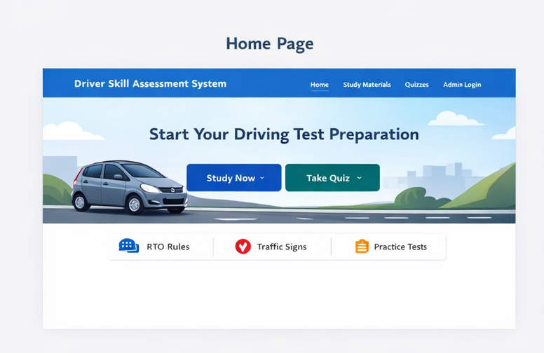
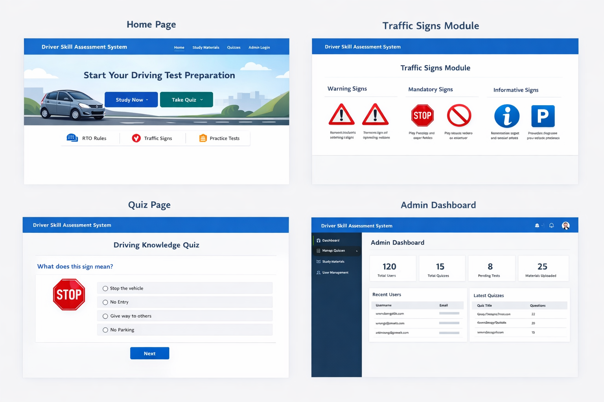
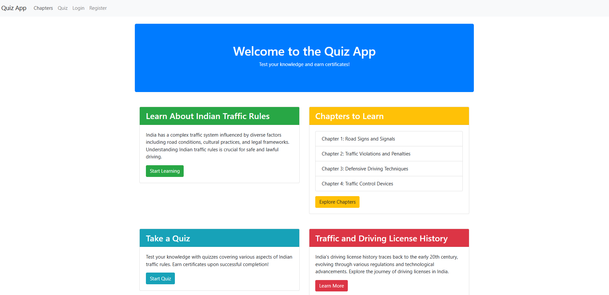
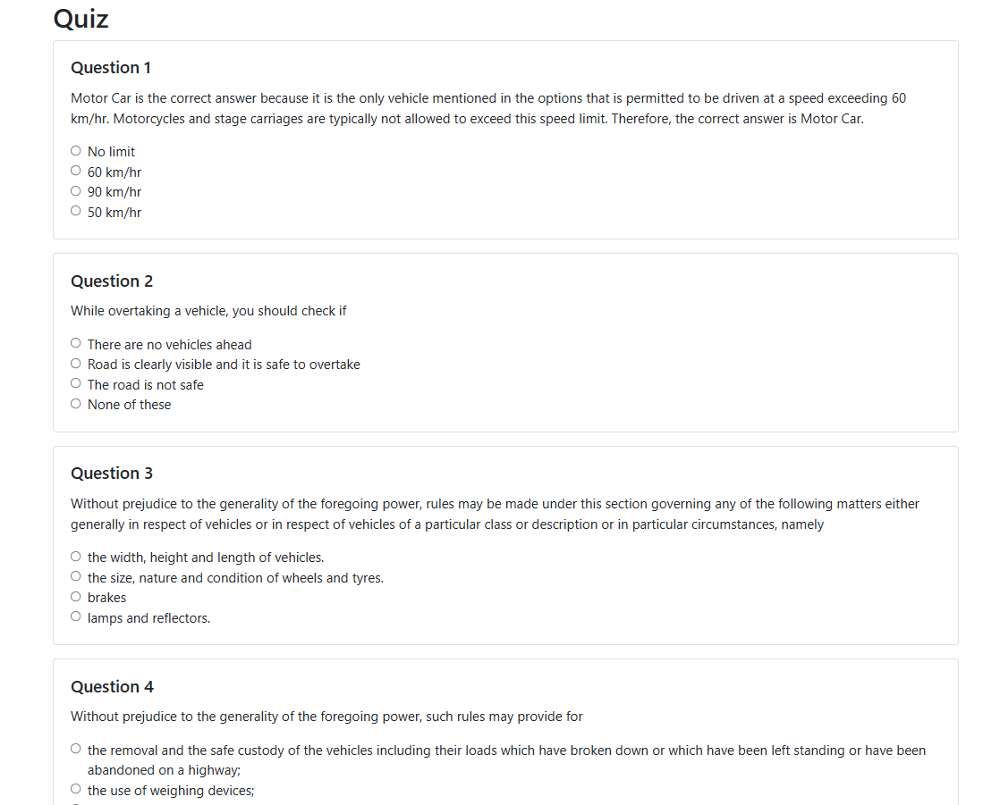

<h4 align="center">Deployed On:</h4>

<p align="center">
  
  
    


</p>


<h3 align="center"><a href="https://driver-one.vercel.app/"><strong>Want to see live preview »</strong></a></h3>

# Driver-Skill-Assessment-System
A web-based learning and assessment platform designed to help learners prepare for driving license tests by studying RTO rules, understanding traffic signs, and practicing through interactive quizzes. The system provides structured learning modules and automated assessments to evaluate users’ knowledge of road safety and traffic regulation


## 📌 Project Overview

- The Driver Skill Assessment System is developed using the Django web framework and provides an interactive environment for individuals preparing for driving tests. The platform focuses on educational guidance, knowledge evaluation, and administrative management.

- Learners can explore structured study materials related to RTO rules, traffic signs, and safe driving practices, and then evaluate their understanding through quizzes. The platform also provides an administrative dashboard that enables content management and user monitoring.

- The primary goal of this project is to simplify driving test preparation while improving awareness of road safety and traffic regulations.
  

## 🎯 Key Objectives

- Help learners prepare for RTO driving license examinations

- Provide structured traffic rule education

- Offer interactive quizzes to test knowledge

- Improve road safety awareness

- Provide centralized content management for administrators

  

## ✨ Features
### 📚 Study Materials

- Structured educational content based on RTO rules and regulations

- Easy-to-understand explanations of driving guidelines

- Organized learning modules for better comprehension


## 🚦 Traffic Signs Learning Module

- Detailed explanations of traffic signs and symbols

- Visual learning support to help users identify road signs quickly

- Improves real-world driving awareness


## 📝 Interactive Quizzes

- Practice quizzes designed to simulate driving test scenarios

- Multiple-choice questions based on traffic rules and safety practices

- Immediate feedback to help learners understand mistakes


## 👤 User-Friendly Interface

- Simple and intuitive UI for seamless navigation

- Accessible learning environment for beginners

- Responsive layout for smooth interaction


## ⚙️ Admin Management System

The admin panel allows administrators to:

- Manage study materials

- Create and update quiz questions

- Monitor user activity

- Maintain platform content efficiently


## 🧰 Technology Stack


| Category   | Technology                  |
|------------|-----------------------------|
| Backend    | Python                      |
| Framework  | Django                      |
| Frontend   | HTML, CSS, JavaScript       |
| Database   | MySQL                       |
| Server     | Django Development Server   |


## 🏗 System Architecture

- The project follows the Model-View-Template (MVT) architecture used by Django.


### Model

- Handles database structure and data management using Django ORM and MySQL.


### View

- Processes user requests, business logic, and communication between models and templates.


### Template

- Responsible for rendering the frontend UI using HTML, CSS, and JavaScript.

- This architecture ensures the system remains scalable, maintainable, and modular.

## ⚙️ Installation & Setup Guide

Follow these steps to run the project locally.


### 1️⃣ Clone the Repository

```
git clone https://github.com/yourusername/driver-skill-assessment-system.git
cd driver-skill-assessment-system
```

### 2️⃣ Create Virtual Environment
```
python -m venv venv

```

### 3️⃣ Activate Virtual Environment
#### Windows

```
venv\Scripts\activate
```

#### Linux / Mac

```
source venv/bin/activate
```
### 4️⃣ Install Required Dependencies

```
pip install -r requirements.txt

```
### 5️⃣ Configure Database
```
Update database configuration in:

settings.py

Example configuration:

DATABASES = {
    'default': {
        'ENGINE': 'django.db.backends.mysql',
        'NAME': 'driver_assessment_db',
        'USER': 'root',
        'PASSWORD': 'yourpassword',
        'HOST': 'localhost',
        'PORT': '3306',
    }
}

```


### 6️⃣ Apply Database Migrations

```
python manage.py makemigrations
python manage.py migrate

```

### 7️⃣ Create Superuser


```
python manage.py createsuperuser
```
This allows access to the Django Admin Panel.


### 8️⃣ Run Development Server
```
python manage.py runserver

Open in browser:

http://127.0.0.1:8000

Admin dashboard:

http://127.0.0.1:8000/admin

```


## 📂 Project Structure

```
driver-skill-assessment-system/
│
├── driver_assessment/          # Main Django application
│   ├── models.py               # Database models
│   ├── views.py                # Application logic
│   ├── urls.py                 # URL routing
│   └── admin.py                # Admin configuration
│
├── templates/                  # HTML templates
│   ├── index.html
│   ├── study_materials.html
│   ├── quiz.html
│   └── results.html
│
├── static/                     # Static files
│   ├── css/
│   ├── js/
│   └── images/
│
├── screenshots/                # Project screenshots
│
├── manage.py                   # Django project manager
│
└── requirements.txt            # Python dependencies

```


## 📸 Screenshots





## 🚀 Future Improvements

The following improvements can enhance the system further:

- AI-powered driver knowledge evaluation

- Performance analytics dashboard for users

- Gamification features for engaging learning

- Mobile-friendly responsive UI

- Multi-language support

- Integration with official RTO learning resources

- Real-time practice exam simulations


## 📈 Potential Use Cases

- Driving schools for student training

- Learners preparing for driving license exams

- Educational institutions teaching road safety

- Online driving theory practice platforms

## 👨‍💻 Author

### Divya H

Software Developer | Python & Web Development Enthusiast

- 💻 Interested in **Full Stack Development**
- 🚀 Passionate about building **real-world web applications**
- 🛠 Skilled in **Python, Django, and SQL**


GitHub:
https://github.com/divyah0

⭐ If you find this project useful, consider starring the repository to support the project.
